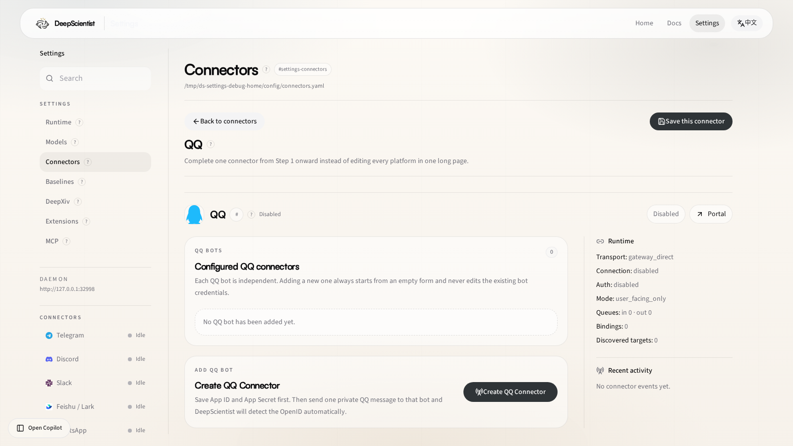

# 03 QQ Connector Guide: Use QQ With DeepScientist

This guide explains how to talk to DeepScientist through QQ and how to configure the QQ connector from the DeepScientist `Settings` page.

This guide assumes the current built-in DeepScientist QQ runtime:

- official QQ Gateway direct connection
- no public callback URL required
- no `relay_url` required
- no extra QQ plugin installation

If you previously followed an OpenClaw or NanoClaw article, note the key difference: DeepScientist already includes the QQ connector runtime. You configure it from `Settings > Connectors > QQ` instead of installing a separate plugin from the CLI.

## 1. What you get after setup

After finishing this guide, you should be able to:

- chat with DeepScientist from QQ private messages
- let QQ auto-bind to the latest active project
- use `/new`, `/use latest`, `/status`, and related commands from QQ
- see the detected `openid` in the `Settings` page
- run safe readiness checks and send probes from the `Settings` page
- receive auto-generated metric timeline images after each recorded main experiment when QQ is the bound quest connector

### Deployment checklist before you start

Before configuring anything, make sure all of these are already true:

- DeepScientist is installed and the daemon / web UI is already running
- you can open `Settings > Connectors`
- you already have the QQ bot `AppID` and `AppSecret`
- you have a real QQ account ready to send the first private message to the bot
- if you changed QQ settings before, `Restart gateway on config change` should stay enabled

If any of the items above is still missing, fix that first. It saves a lot of unnecessary debugging later.

## 2. Register a QQ bot

This section is based on the Tencent Cloud developer article “OpenClaw 接入 QQ 机器人”:

- Source article: https://cloud.tencent.com/developer/article/2635190
- Official QQ Bot platform: https://bot.q.qq.com/

Use the official QQ Bot platform as the primary source of truth. The screenshot below is included only to make the registration flow easier to recognize.

### 2.1 Open the bot registration entry

Prefer the official platform:

```text
https://bot.q.qq.com/
```

The Tencent Cloud article also shows this quick-entry page:

```text
https://q.qq.com/qqbot/openclaw/login.html
```


### 2.2 Sign in and create the bot

1. Sign in with QQ by scanning the QR code.
2. Create a new QQ bot.
3. Finish the basic bot setup in the Tencent console.

### 2.3 Save `AppID` and `AppSecret` immediately

After creation, record these two values right away:

| Field | Meaning | Required by DeepScientist |
| --- | --- | --- |
| `AppID` | Unique bot identifier | Yes |
| `AppSecret` | Secret used to call the QQ Bot API | Yes |

Important pitfalls:

- `AppSecret` is usually shown only once when created or reset.
- If you lose it, you will normally need to reset it in the console.
- DeepScientist only needs these two credentials to start the built-in QQ gateway direct path.

## 3. What you do **not** need in DeepScientist

This matters a lot if you are coming from an OpenClaw-style guide.

In DeepScientist, you do **not** need to:

- install `@sliverp/qqbot`
- run `openclaw channels add ...`
- configure a public callback URL
- configure `relay_url`
- manually fill `openid` before the first inbound QQ message

DeepScientist currently uses this path:

- fixed `transport: gateway_direct`
- direct `app_id + app_secret`
- automatic `openid` detection after the first private QQ message

## 4. Configure QQ from the Settings page

Open:

- [Settings > Connectors > QQ](/settings/connector/qq)

### Settings page at a glance

This is the real QQ connector page after launch. Use it to:

- add the QQ connector entry
- save `App ID` and `App Secret`
- review runtime state, discovered targets, and recent activity
- confirm that `openid` was learned after the first inbound QQ message



The link jumps directly to the `QQ` connector card. The page is now organized into these anchored setup steps:

- `#connector-qq-step-credentials`: enter `App ID` and `App Secret`
- `#connector-qq-step-bind`: save first, then send the first QQ private message
- `#connector-qq-step-success`: confirm the auto-detected OpenID
- `#connector-qq-step-advanced`: advanced settings and milestone delivery switches

### 4.1 Recommended field order

| Field | How to fill it | Recommendation |
| --- | --- | --- |
| `Enabled` | Turn it on | Required |
| `Transport` | Keep `gateway_direct` | Fixed, do not change |
| `App ID` | Paste the `AppID` from the QQ bot console | Required |
| `App secret` | Paste the `AppSecret` from the QQ bot console | Required |
| `Detected OpenID` | Leave empty at first | Auto-filled after the first private message |

The remaining settings such as group mention policy, command prefix, auto-binding, and milestone delivery live under `#connector-qq-step-advanced`. Milestone delivery now defaults to fully enabled; only change those switches if you want less outbound push.

### 4.2 Important things to notice before saving

- QQ does not need `public_callback_url`
- QQ does not need `relay_url`
- `Detected OpenID` is not something you must fill before the first test
- It is normal for `Detected OpenID` to stay empty until the bot receives the first private QQ message

## 5. Recommended end-to-end test flow

This is the most reliable path with the fewest surprises.

### Step 1: save the credentials

Fill:

- `App ID`
- `App secret`

Then save the connector config.

### Step 2: click “Check”

From the `Settings` page, click:

- `Check`

Expected result:

- no more missing-credential errors for `app_id` or `app_secret`

### Step 3: click “Test all” or QQ-specific “Send probe”

Before the first inbound private message, you may still see a warning like:

```text
QQ readiness is healthy, but no OpenID has been learned yet. Save credentials, then send one private QQ message so DeepScientist can auto-detect and save the `openid`.
```

This usually does **not** mean your credentials are wrong. It means:

- DeepScientist can already exchange `access_token` and probe `/gateway`
- but it still does not know which QQ `openid` should receive an active outbound test message

In other words:

- a successful readiness check is not the same as already having a delivery target

### Step 4: send the first private QQ message to the bot

Start with a private chat, not a group.


You can send:

```text
/help
```

or:

```text
hello
```

If the connector is working, DeepScientist will auto-detect the `openid` for that private conversation and save it into `main_chat_id`.

### Step 5: go back to the Settings page and confirm the state

Refresh or reopen `Settings > Connectors > QQ`, or jump back to [#connector-qq-step-success](/settings/connector/qq#connector-qq-step-success), and check:

- whether `Detected OpenID` is now filled automatically
- whether the `Snapshot` panel shows something close to:
  - `Transport = gateway_direct`
  - `Connection` / `Auth` near `ready`
  - `Discovered targets > 0`
  - `Bound target` showing your `openid`

### Step 6: click “Send probe” again

Now click:

- `Send probe`

If it succeeds, DeepScientist can now:

- actively send messages to that QQ user
- receive new messages from that QQ user

### 5.1 What success looks like

When the connector is fully working, you should usually see all of these:

- the bot replies to `/help`, `/status`, and similar commands
- `Detected OpenID` is no longer empty in `Settings > Connectors > QQ`
- the `Snapshot` panel shows a discovered target and the bound target is no longer empty
- clicking `Send probe` again no longer reports an empty delivery target
- if a latest project already exists, plain text continues that project automatically; if no project exists yet, the bot returns help instead

## 5.3 Automatic main-experiment metric charts

When QQ is the bound quest connector, DeepScientist now auto-sends metric timeline charts after each recorded main experiment.

Current behavior:

- one chart per metric
- the baseline is drawn as a horizontal dashed reference line when a baseline value exists
- the system automatically respects whether the metric is `higher is better` or `lower is better`
- any point that beats baseline gets a star marker
- the latest point is filled with a deep Morandi red
- earlier points are filled with a deep Morandi blue
- if multiple metrics are present, DeepScientist sends them sequentially with about a 2 second gap

These charts are generated from quest-local files and delivered as native QQ images.

If you need to disable this automatic chart delivery, turn off `auto_send_main_experiment_png` in the QQ connector config.

### 5.2 Error quick decoder

| Message | What it usually means | What to do |
| --- | --- | --- |
| `app_id is required` / `app_secret is required` | The credentials are incomplete | Fill the missing field in Settings and save again |
| `401` / `invalid credential` / token exchange failed | The `AppID` or `AppSecret` is wrong, or the secret was reset | Recheck the QQ console values and save them again |
| `QQ readiness is healthy, but no OpenID has been learned yet...` | The credentials probably work, but DeepScientist still does not know which QQ user should receive an active outbound message | Send one private QQ message to the bot first so the runtime can discover the `openid` |
| `QQ callback flow usually needs public_callback_url...` | This comes from an older callback/relay model, not the current DeepScientist direct path | Keep `transport = gateway_direct` and do not add a public callback URL |
| `QQ relay mode needs relay_url...` | The transport was switched to relay mode by mistake | Change it back to `gateway_direct` |
| `Detected OpenID` stays empty | The bot has not received the first private QQ message yet, or the gateway did not restart cleanly after config changes | Save the config first, then send a private QQ message, and restart the gateway if needed |

## 6. How to talk to DeepScientist from QQ

Common commands:

| Command | Meaning |
| --- | --- |
| `/help` | Show help |
| `/projects` or `/list` | List projects |
| `/use <quest_id>` | Bind a specific project |
| `/use latest` | Bind the newest project |
| `/new <goal>` | Create a new project and bind the current QQ conversation |
| `/status` | Show the current project status |

Recommended usage:

- if a latest project already exists, plain text usually continues that project
- if there is no project yet, start with `/new <goal>`
- if you want to switch to another project, send `/use <quest_id>` explicitly

## 7. Most common mistakes

### 7.1 Assuming QQ needs a public callback

The current DeepScientist QQ path does **not** require a public callback.

If you see these ideas from older guides, ignore them for DeepScientist:

- `public_callback_url`
- `relay_url`

### 7.2 Assuming a failed active send test means the credentials are wrong

If the warning says the target is empty, the usual reason is:

- you have not sent the first private QQ message yet
- the runtime has not auto-detected the `openid` yet

That is a different problem from invalid `app_id` or `app_secret`.

### 7.3 Thinking you must manually discover `openid`

In DeepScientist, the easiest path is not manual lookup. Instead:

1. save `App ID` and `App secret`
2. send one private QQ message to the bot
3. let the runtime auto-fill `Detected OpenID`

### 7.4 Bot does not respond in a group

Check:

- whether you actually `@` mentioned the bot
- whether `Require @ mention in groups` is enabled

If private chat is not working yet, do not start group debugging first.

### 7.5 A different operator now uses QQ, but `main_chat_id` is still the old one

If a previous `main_chat_id` is already saved, a new private user may not automatically overwrite it.

In that case:

- decide who the primary QQ operator should be
- clear or update the QQ target explicitly if needed
- then rerun the private-message test flow

## 8. Smallest reliable deployment sequence

If you only want the shortest path that works:

1. create the QQ bot
2. save `AppID` and `AppSecret`
3. open [Settings > Connectors > QQ](/settings/connector/qq)
4. enable QQ and fill `App ID` / `App secret`
5. save and click `Check`
6. send `/help` to the bot from your QQ private chat
7. verify that `Detected OpenID` is now filled
8. click `Send probe` again
9. start using `/new <goal>` or `/use latest`

## 9. References

- Tencent Cloud developer article: “OpenClaw 接入 QQ 机器人”
  - https://cloud.tencent.com/developer/article/2635190
- Official QQ Bot platform
  - https://bot.q.qq.com/

Notes:

- the bot-registration flow and screenshots in this guide are based on the Tencent Cloud article above
- the actual DeepScientist connector behavior follows the current built-in DeepScientist QQ runtime, not the OpenClaw plugin workflow
