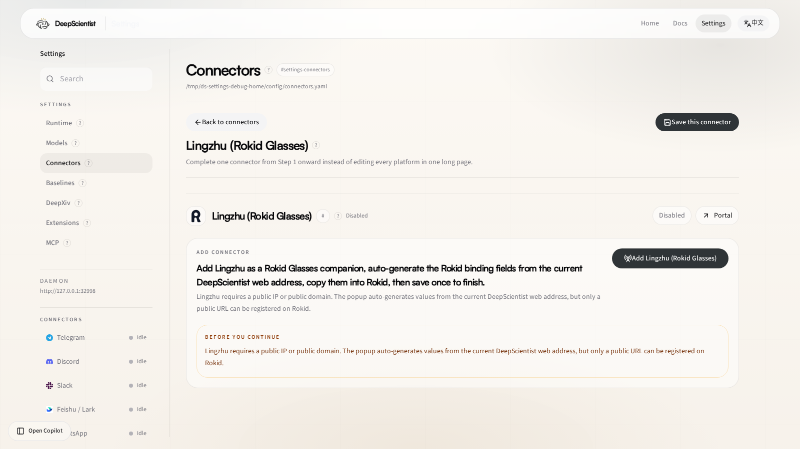

# 04 Lingzhu Connector Guide: Bind Rokid Glasses to DeepScientist

Lingzhu now uses a minimal one-step binding flow.

DeepScientist serves the Lingzhu-compatible routes directly on its own daemon / web port:

- `GET /metis/agent/api/health`
- `POST /metis/agent/api/sse`

For a real device binding, the address registered on Rokid must be the public DeepScientist address that external devices can reach. It cannot be `127.0.0.1`, `localhost`, or a private-network address.

References:

- Rokid developer forum: https://forum.rokid.com/post/detail/2831
- Rokid agent platform: https://agent-develop.rokid.com/space

## 1. Prerequisites

Make sure:

- DeepScientist is already running
- the DeepScientist page you opened is the final public address that external devices should use
- if the current page is local-only or private-network-only, Lingzhu should not be saved yet

## 2. What the UI keeps now

`Settings > Connectors > Lingzhu` now keeps only the necessary pieces:

- one `Add Lingzhu (Rokid Glasses)` entry point
- the Rokid platform screenshot
- the auto-generated copyable fields
- concise binding instructions
- one save action

You no longer need to manually edit host, port, agent, OpenClaw snippets, or extra probe steps in the main flow.

## 3. What is auto-generated

After you click `Add Lingzhu (Rokid Glasses)`, the popup shows these copyable values:

- Custom agent ID
- Custom agent URL
- Custom agent AK
- Agent name
- Category
- Capability summary
- Opening message
- Input type
- Icon PNG URL

Important details:

- `Custom agent URL` is generated as `https://<your-public-address>/metis/agent/api/sse`
- `AK` is generated automatically and reused after saving
- the logo uses a PNG DeepScientist asset so it can be uploaded directly to Rokid

## 4. What the user does

On the Rokid platform:

1. Open `Project Development -> Third-party Agent -> Create`
2. Choose `Custom Agent`
3. Copy each generated field from the popup into the matching Rokid field
4. Upload the DeepScientist PNG logo
5. Return to DeepScientist and click Save

After Save, the Lingzhu binding is complete.

## 5. How it is used afterward

The glasses or platform only need to call:

- `POST /metis/agent/api/sse`

with:

- `Authorization: Bearer <saved-AK>`

Usage rules:

- a new task must start with `我现在的任务是 ...`
- only the text after that prefix is treated as a fresh DeepScientist task
- if you only want buffered progress, do not repeat the prefix; just say `找DeepScientist` or `继续`

## 6. Common questions

### Why can’t I use `127.0.0.1`?

Because Rokid and external devices cannot reach your local loopback address. Lingzhu must register a public address.

### Why is `AK` generated automatically?

Because `AK` is the Bearer secret for this external entrypoint. Generating and persisting it is safer and more reliable than asking users to type it manually.

### Do I still need to tune a lot of extra parameters after saving?

No. The goal of the current Lingzhu flow is to show only the necessary values, let the user copy them, and finish with one save.
