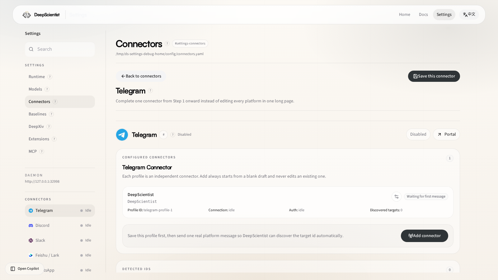

# 16 Telegram Connector Guide

Use this guide when you want DeepScientist to continue a quest through Telegram.

Telegram in the current open-source runtime uses the built-in polling path:

- no public webhook is required
- the main credential is the BotFather token
- direct messages can auto-bind to the latest active quest when enabled

## 1. What Telegram support includes

DeepScientist currently supports Telegram through:

- `TelegramPollingService` for inbound polling
- `GenericRelayChannel` for bindings, inbox/outbox, targets, and runtime status
- `TelegramConnectorBridge` for direct outbound sends through the Bot API

This means Telegram already fits the same quest-binding model as the other connector surfaces.

## 2. Recommended setup path

1. Open BotFather.
2. Run `/newbot`.
3. Save the generated bot token.
4. Open `Settings > Connectors > Telegram`.
5. Enable Telegram.
6. Keep `transport: polling`.
7. Fill `bot_token`.
8. Save the connector.
9. Send one real private message such as `/start` or `/help` to the bot.
10. Return to DeepScientist and verify that the runtime has discovered the target conversation.

## 2.1 Settings page at a glance

Route:

- [Settings > Connectors > Telegram](/settings/connector/telegram)

Use this page to:

- keep `transport: polling`
- fill `bot_token`
- inspect target discovery and runtime state after the first message

## 3. Important config fields

Main fields:

- `enabled`
- `transport`
- `bot_name`
- `bot_token`
- `command_prefix`
- `require_mention_in_groups`
- `dm_policy`
- `allow_from`
- `group_policy`
- `group_allow_from`
- `groups`
- `auto_bind_dm_to_active_quest`

For the full field reference, see [01 Settings Reference](./01_SETTINGS_REFERENCE.md).

## 4. Binding model

Telegram conversations are normalized into quest-aware connector ids like:

- `telegram:direct:<chat_id>`
- `telegram:group:<chat_id>`

DeepScientist binds quests to those normalized conversation ids, not to transient webhook state.

Important rules:

- one quest keeps local access plus at most one external connector target
- direct messages can auto-follow the latest active quest when auto-bind is enabled
- bindings can be changed later from the project settings page

## 5. Group chat behavior

By default:

- Telegram direct messages are allowed
- group behavior depends on `group_policy`
- if `require_mention_in_groups` is `true`, the bot only reacts when explicitly mentioned or when a command is used

This is the recommended default for larger shared groups.

## 6. Outbound delivery

Telegram outbound delivery currently focuses on text-first quest updates:

- progress
- milestone summaries
- binding notices
- structured quest replies

The current bridge uses `sendMessage` through the Bot API.

## 7. Troubleshooting

### Telegram does not appear in Settings

Telegram may be hidden by the system connector gate. Confirm that:

- `config.connectors.system_enabled.telegram` is `true`

### Validation says credentials are missing

Check that:

- `bot_token` is filled
- or `bot_token_env` points at a real environment variable

### The bot receives no messages

Check that:

- the bot token is correct
- the bot was started from Telegram at least once
- `transport` is still `polling`
- no stale public webhook is intercepting updates

### Group messages do not trigger the bot

Check:

- `group_policy`
- `groups`
- `group_allow_from`
- `require_mention_in_groups`

### The quest does not continue from Telegram

Check that:

- the conversation is bound to the intended quest
- or `auto_bind_dm_to_active_quest` is enabled for direct-message pairing

## 8. Related docs

- [01 Settings Reference](./01_SETTINGS_REFERENCE.md)
- [02 Start Research Guide](./02_START_RESEARCH_GUIDE.md)
- [09 Doctor](./09_DOCTOR.md)
- [13 Core Architecture Guide](./13_CORE_ARCHITECTURE_GUIDE.md)
