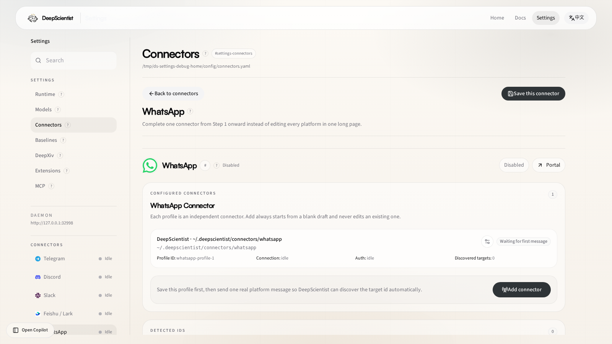

# 17 WhatsApp Connector Guide

Use this guide when you want DeepScientist to continue a quest through WhatsApp.

The current open-source runtime prefers the local-session path for WhatsApp:

- no public webhook is required for the recommended path
- the local auth/session state stays on your machine
- direct messages can auto-bind to the latest active quest when enabled

## 1. What WhatsApp support includes

DeepScientist currently supports WhatsApp through:

- `WhatsAppLocalSessionService` for local session sync and inbound ingestion
- `GenericRelayChannel` for bindings, inbox/outbox, targets, and runtime status
- `WhatsAppConnectorBridge` for outbound delivery

For the recommended path, outbound delivery is queued into the local-session outbox and handled by the local sidecar/session runtime.

## 2. Recommended setup path

1. Open `Settings > Connectors > WhatsApp`.
2. Enable WhatsApp.
3. Keep `transport: local_session`.
4. Keep or choose a writable `session_dir`.
5. Save the connector.
6. Complete the local login flow for the WhatsApp session.
7. Send one real message from WhatsApp.
8. Return to DeepScientist and verify that the target conversation has been discovered.

## 2.1 Settings page at a glance

Route:

- [Settings > Connectors > WhatsApp](/settings/connector/whatsapp)

Use this page to:

- keep `transport: local_session`
- choose the local session directory
- inspect discovered targets and runtime state after the first real WhatsApp message

## 3. Important config fields

Main fields:

- `enabled`
- `transport`
- `bot_name`
- `auth_method`
- `session_dir`
- `command_prefix`
- `dm_policy`
- `allow_from`
- `group_policy`
- `group_allow_from`
- `groups`
- `auto_bind_dm_to_active_quest`

For the full field reference, see [01 Settings Reference](./01_SETTINGS_REFERENCE.md).

## 4. Binding model

WhatsApp conversations are normalized into quest-aware connector ids like:

- `whatsapp:direct:<jid>`
- `whatsapp:group:<jid>`

DeepScientist binds quests to those normalized conversation ids instead of transient browser/session state.

Important rules:

- one quest keeps local access plus at most one external connector target
- direct messages can auto-follow the latest active quest when auto-bind is enabled
- bindings can be changed later from the project settings page

## 5. Local-session runtime behavior

The current open-source path is local-session oriented:

- runtime status is mirrored into DeepScientist under connector logs
- inbound messages are drained from the local session inbox
- outbound messages are queued into the local session outbox

This keeps the recommended WhatsApp path local-first.

## 6. Group behavior

By default:

- direct messages can pair with the active quest
- group behavior depends on `group_policy`
- group allowlists can be enforced through `groups` and `group_allow_from`

## 7. Troubleshooting

### WhatsApp does not appear in Settings

WhatsApp may be hidden by the system connector gate. Confirm that:

- `config.connectors.system_enabled.whatsapp` is `true`

### Validation says the connector is not ready

Check that:

- `transport` is `local_session`
- `session_dir` points to a writable path

### No discovered targets appear

Check that:

- the local login/session flow has completed
- at least one real inbound message has reached the local session inbox

### The quest does not continue from WhatsApp

Check that:

- the conversation is bound to the intended quest
- or `auto_bind_dm_to_active_quest` is enabled for direct-message pairing

### Outbound messages do not arrive

Check that:

- the local-session sidecar or local session processor is running
- the local session outbox is being drained
- the target JID is correct

## 8. Related docs

- [01 Settings Reference](./01_SETTINGS_REFERENCE.md)
- [02 Start Research Guide](./02_START_RESEARCH_GUIDE.md)
- [09 Doctor](./09_DOCTOR.md)
- [13 Core Architecture Guide](./13_CORE_ARCHITECTURE_GUIDE.md)
