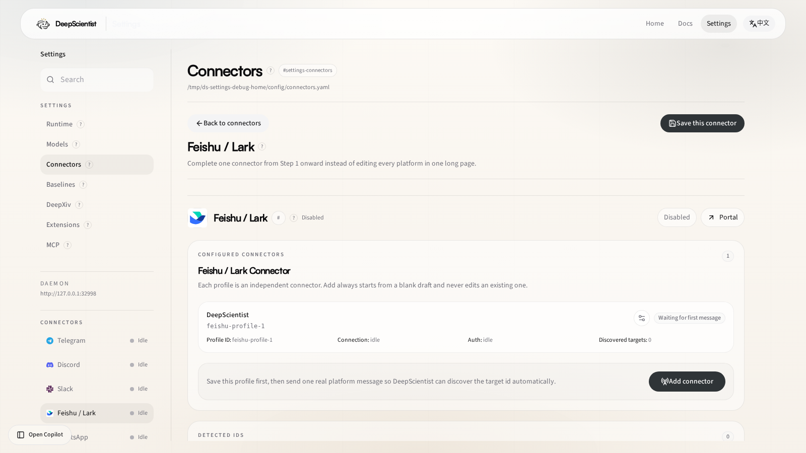

# 18 Feishu Connector Guide

Use this guide when you want DeepScientist to continue a quest through Feishu / Lark.

The current open-source runtime prefers the built-in long-connection path:

- no public event callback is required for the recommended setup
- the main credentials are `app_id` and `app_secret`
- direct messages can auto-bind to the latest active quest when enabled

## 1. What Feishu support includes

DeepScientist currently supports Feishu through:

- `FeishuLongConnectionService` for inbound long-connection delivery
- `GenericRelayChannel` for bindings, inbox/outbox, targets, and runtime status
- `FeishuConnectorBridge` for direct outbound sends

This means Feishu already fits the same quest-binding model as the other connector surfaces.

## 2. Recommended setup path

1. Open the Feishu / Lark developer platform.
2. Create an app.
3. Save `app_id` and `app_secret`.
4. Open `Settings > Connectors > Feishu`.
5. Enable Feishu.
6. Keep `transport: long_connection`.
7. Fill `app_id` and `app_secret`.
8. Save the connector.
9. Send one real message to the bot.
10. Return to DeepScientist and confirm that the target conversation has been discovered.

## 2.1 Settings page at a glance

Route:

- [Settings > Connectors > Feishu](/settings/connector/feishu)

Use this page to:

- keep `transport: long_connection`
- fill `app_id` and `app_secret`
- inspect runtime status, discovered targets, and connector health after the first message

## 3. Important config fields

Main fields:

- `enabled`
- `transport`
- `bot_name`
- `app_id`
- `app_secret`
- `api_base_url`
- `command_prefix`
- `dm_policy`
- `allow_from`
- `group_policy`
- `group_allow_from`
- `groups`
- `require_mention_in_groups`
- `auto_bind_dm_to_active_quest`

For the full field reference, see [01 Settings Reference](./01_SETTINGS_REFERENCE.md).

## 4. Binding model

Feishu conversations are normalized into quest-aware connector ids like:

- `feishu:direct:<chat_id>`
- `feishu:group:<chat_id>`

DeepScientist binds quests to those normalized conversation ids, not to transient callback payloads.

Important rules:

- one quest keeps local access plus at most one external connector target
- direct messages can auto-follow the latest active quest when auto-bind is enabled
- bindings can be changed later from the project settings page

## 5. Group behavior

By default:

- direct messages are allowed
- group behavior depends on `group_policy`
- if `require_mention_in_groups` is `true`, the bot only reacts when explicitly mentioned or when a command is used

This is the recommended default for larger shared workspaces.

## 6. Outbound delivery

Feishu outbound delivery currently focuses on text-first quest updates:

- progress
- milestone summaries
- binding notices
- structured quest replies

The current bridge delivers through the Feishu Open Platform messaging API.

## 7. Troubleshooting

### Feishu does not appear in Settings

Feishu may be hidden by the system connector gate. Confirm that:

- `config.connectors.system_enabled.feishu` is `true`

### Validation says credentials are missing

Check that:

- `app_id` is filled
- `app_secret` is filled
- or `app_secret_env` points at a real environment variable

### No discovered targets appear

Check that:

- the app credentials are correct
- the bot has received at least one real inbound message
- `transport` is still `long_connection`

### Group messages do not trigger the bot

Check:

- `group_policy`
- `groups`
- `group_allow_from`
- `require_mention_in_groups`

### The quest does not continue from Feishu

Check that:

- the conversation is bound to the intended quest
- or `auto_bind_dm_to_active_quest` is enabled for direct-message pairing

## 8. Related docs

- [01 Settings Reference](./01_SETTINGS_REFERENCE.md)
- [02 Start Research Guide](./02_START_RESEARCH_GUIDE.md)
- [09 Doctor](./09_DOCTOR.md)
- [13 Core Architecture Guide](./13_CORE_ARCHITECTURE_GUIDE.md)
