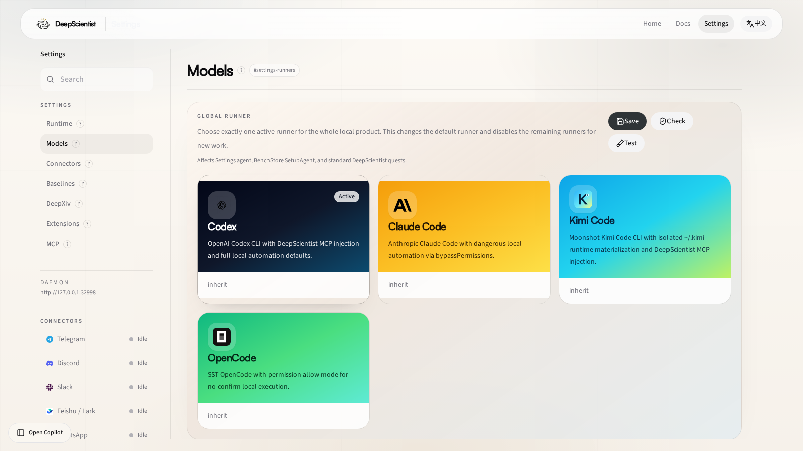

# Kimi Code Provider Setup

Use this guide when you want DeepScientist to run through the official Kimi Code CLI as a separate builtin runner instead of reusing the Claude path.

The right order is:

1. install the official `kimi` CLI
2. complete the login flow directly in the terminal
3. confirm `kimi` works on its own
4. run `ds doctor --runner kimi`
5. only then switch DeepScientist to the `kimi` runner

## What DeepScientist expects

- Install the official `kimi` CLI and make sure `kimi --version` works in the same shell that launches DeepScientist.
- Complete the first-run login flow once with `kimi login` or by starting `kimi` interactively.
- Your global Kimi home should normally live at `~/.kimi/`.

## What success looks like

Before you switch DeepScientist over to Kimi, these should already be true:

- `kimi --version` prints a real version
- `kimi login` has completed successfully
- the CLI can answer at least one minimal prompt
- `ds doctor --runner kimi` passes the Kimi startup probe

If one of those is still false, stay with terminal-level Kimi troubleshooting first.

## Step 1: install and verify the Kimi CLI

Use the official installation path for the current Kimi Code CLI.

After installation, verify the binary you will actually use:

```bash
which kimi
kimi --version
```

If `which kimi` prints nothing, fix the shell PATH first before touching DeepScientist settings.

## Step 2: complete Kimi login directly

Run:

```bash
kimi login
```

If your local Kimi setup prefers an interactive first-run flow, start `kimi` once directly and complete login there.

Do this before opening DeepScientist settings for Kimi.

## Step 3: validate Kimi directly

The smallest practical check is:

```bash
kimi --print --input-format text --output-format stream-json --yolo
```

Then send a tiny prompt such as:

```text
Reply with exactly HELLO.
```

What you want to prove here is simple:

- the CLI starts
- the login state is valid
- the session can produce a normal answer

## Settings-first path after launch

If DeepScientist is already running, use the visual `Models` page first:

- route: `/settings/runners`

Use it to:

- switch the global default runner to `Kimi`
- enable the Kimi runner
- fill `binary`, `config_dir`, `model`, `agent`, `thinking`, and `yolo`



Recommended first values:

- `binary`: `kimi`
- `config_dir`: `~/.kimi`
- `model`: `inherit`
- `agent`: leave empty unless your direct Kimi CLI already depends on a named agent
- `thinking`: leave `false` first unless you already know you want longer default reasoning
- `yolo`: keep `true` for unattended local automation

## Recommended `runners.yaml` shape

```yaml
kimi:
  enabled: true
  binary: kimi
  config_dir: ~/.kimi
  model: inherit
  agent: ""
  thinking: false
  yolo: true
```

Use raw `runners.yaml` editing only when:

- the web UI is not available
- you are scripting setup
- you want repeatable machine provisioning

## Runtime behavior

- DeepScientist copies your configured `~/.kimi` home into an isolated quest runtime under `.ds/kimi-home/.kimi`.
- Quest-local skills are mirrored into `.kimi/skills`.
- Builtin DeepScientist MCP servers are injected through a generated `.kimi/mcp.json`.
- Prompts are sent over stdin, so long DeepScientist turns do not hit argv length limits.

## Step 4: validate DeepScientist before switching globally

Run:

```bash
ds doctor --runner kimi
```

You want the Kimi section to confirm:

- the `kimi` binary is found
- the configured `config_dir` is readable
- the startup probe succeeds

Only after that should you switch the global default runner to `kimi`.

## Step 5: switch the default runner

You can do that in either place:

- `Settings -> Runtime -> Default runner`
- `~/DeepScientist/config/config.yaml`

Once DeepScientist is already running, the visual Settings page is the intended path.

## Common failure cases

### `kimi` is not on PATH

Check:

```bash
which kimi
kimi --version
```

If needed, set the absolute binary path in the `Models` page or `runners.yaml`.

### `kimi login` worked once, but `ds doctor --runner kimi` still fails

Usually one of these is wrong:

- the shell used by DeepScientist is not the same shell where `kimi` was tested
- `config_dir` points at the wrong Kimi home
- the local Kimi session was only partially initialized

### Kimi works directly, but DeepScientist still should not use it yet

Do not switch the default runner immediately if:

- the CLI only works intermittently
- you still need manual interactive confirmations
- the startup probe fails even though interactive mode works

In that case, keep Codex as the default until the Kimi path is stable.
