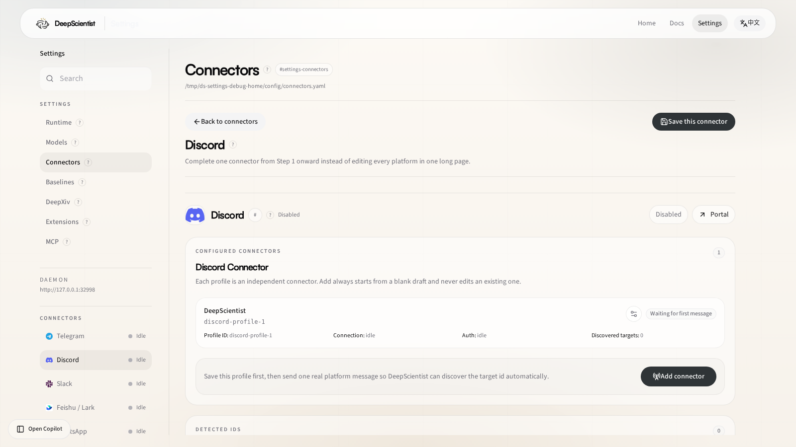

# 28 Discord Connector Guide

Use this guide when you want to configure and operate the built-in Discord connector through the DeepScientist `Settings` page.

Discord now lives under the same connector surface as QQ, Telegram, Slack, Feishu, WhatsApp, WeChat, and Lingzhu. You do not need a separate relay process or a public callback URL for the recommended path.

## 1. Open The Connector Page

Route:

- [Settings > Connectors > Discord](/settings/connector/discord)

This is the page you should use after launch for normal Discord setup.

## 2. What This Page Is For

Use the Discord page when you need to:

- configure the built-in `gateway` transport
- enter `bot_token` and `application_id`
- review runtime status, discovered targets, and connector events
- save connector changes without editing `connectors.yaml` manually

## 3. Recommended Setup Path

1. Open the Discord Developer Portal.
2. Create or select the bot application.
3. Copy the bot token and application id.
4. Open `Settings > Connectors > Discord`.
5. Keep `transport: gateway`.
6. Fill `bot_token` and `application_id`.
7. Save the connector.
8. Send one real message to the bot from Discord.
9. Return to this page and confirm that targets or runtime activity are now visible.

## 4. What To Check On This Page

Before you leave the page, confirm:

- `Transport` still shows `gateway`
- the connector card saves cleanly
- runtime status updates after the first real Discord message
- discovered targets and bindings start appearing once the bot is actually contacted

## 5. When To Use Raw YAML Instead

You can stay in the `Settings` page for ordinary setup.

Open `~/DeepScientist/config/connectors.yaml` directly only when you need:

- scripted provisioning
- bulk edits across many connectors
- environment-variable injection patterns that are easier to manage in files

## 6. Related Docs

- [01 Settings Reference](./01_SETTINGS_REFERENCE.md)
- [30 Settings Control Center Guide](./30_SETTINGS_CONTROL_CENTER_GUIDE.md)
- [09 Doctor](./09_DOCTOR.md)
