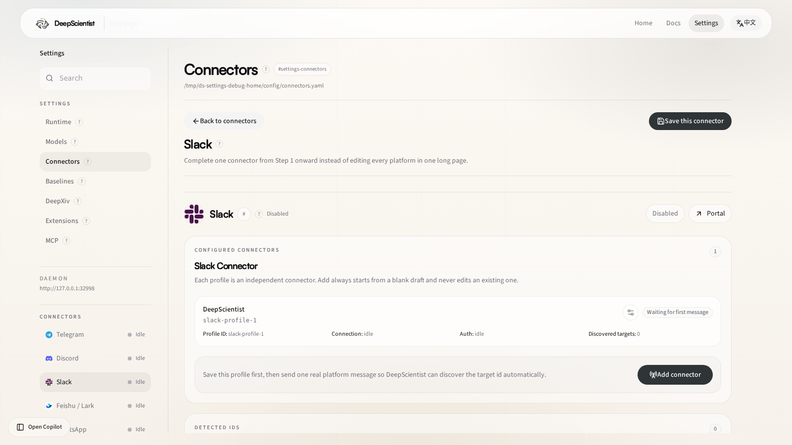

# 29 Slack Connector Guide

Use this guide when you want to configure and operate the built-in Slack connector through the DeepScientist `Settings` page.

Slack uses the built-in Socket Mode path in the current open-source runtime. The intended operator flow is visual-first: launch DeepScientist, open `Settings`, then complete the connector setup there.

## 1. Open The Connector Page

Route:

- [Settings > Connectors > Slack](/settings/connector/slack)

## 2. What This Page Is For

Use the Slack page when you need to:

- configure the built-in `socket_mode` transport
- enter `bot_token` and `app_token`
- review discovered targets and connector runtime state
- save Slack setup without manually editing `connectors.yaml`

## 3. Recommended Setup Path

1. Open the Slack App dashboard.
2. Create or select the Slack app.
3. Enable Socket Mode.
4. copy the `bot_token`
5. copy the `app_token`
6. open `Settings > Connectors > Slack`
7. keep `transport: socket_mode`
8. fill `bot_token` and `app_token`
9. save the connector
10. send one real Slack message so DeepScientist can discover the runtime target

## 4. What To Check On This Page

Before leaving the page, confirm:

- `Transport` remains `socket_mode`
- the connector saves without local validation errors
- runtime status changes after the first real Slack message
- discovered targets and bindings become non-empty once the bot has real traffic

## 5. When To Use Raw YAML Instead

Stay in `Settings` for ordinary setup, rotation, and inspection.

Use raw `connectors.yaml` only when you need:

- scripted rollout
- bulk edits
- environment-variable injection patterns that are easier to maintain in files

## 6. Related Docs

- [01 Settings Reference](./01_SETTINGS_REFERENCE.md)
- [30 Settings Control Center Guide](./30_SETTINGS_CONTROL_CENTER_GUIDE.md)
- [09 Doctor](./09_DOCTOR.md)
