# 30 Settings Control Center Guide

This guide covers the operator-facing `Settings` pages that are not primarily about editing config files.

These routes are for runtime supervision, diagnostics, fleet inspection, repair workflow, controller execution, and admin search.

Use this guide after DeepScientist is already running and you want to understand which `Settings` page to open next.

## How To Use This Guide

This guide is not a field reference. It is an operator manual.

Use it when:

- DeepScientist is already open in the browser
- something looks wrong, stale, blocked, or unclear
- you need to know which `Settings` page to open first

Read it in this order:

1. use the decision table below
2. open the recommended page
3. follow the page-specific actions
4. only then drop down into logs, raw YAML, or direct CLI diagnosis

## Quick Decision Table

If you are not sure where to start, use this table first.

| Situation | Start here | Then go to |
| --- | --- | --- |
| “I just want to know whether the system is healthy.” | `Summary` | `Runtime`, `Diagnostics`, or `Errors` |
| “A connector feels broken or messages stopped flowing.” | `Connector Health` | `Errors`, then the connector-specific page |
| “The machine boundary or session evidence looks wrong.” | `Sessions & Hardware` | `Quests` or `Quest Detail` |
| “I need a real diagnosis, not just a status view.” | `Diagnostics` | `Errors`, then `Logs` |
| “I already know something failed and want the shortest triage view.” | `Errors` | `Issue Report` or `Logs` |
| “I need raw evidence.” | `Logs` | `Quest Detail` if the problem is quest-specific |
| “One quest needs deeper inspection.” | `Quests` | `Quest Detail` |
| “I want to reopen or continue a repair workflow.” | `Repairs` | `Quest Detail` or `Diagnostics` |
| “I want policy-level governance, not one-off debugging.” | `Controllers` | `Summary` or `Repairs` |
| “I want charts, trends, and fleet movement, not raw tables.” | `Stats` | `Quest Detail` |
| “I know a term, quest id, or event summary but not where it lives.” | `Search` | `Quest Detail` or `Logs` |

## 1. Summary

Route:

- `/settings/summary`

Use this page when you want:

- a first health check
- a compact view of current quest pressure
- a quick sense of hardware load and current attention points

What to do here:

1. look at the top cards first
2. decide whether the pressure looks like a quest problem, a connector problem, or a machine problem
3. open `Runtime`, `Connector Health`, `Diagnostics`, or `Errors` based on that first signal

Do not start here when:

- you already know which quest is broken
- you need raw logs immediately
- you already need a connector-specific config page

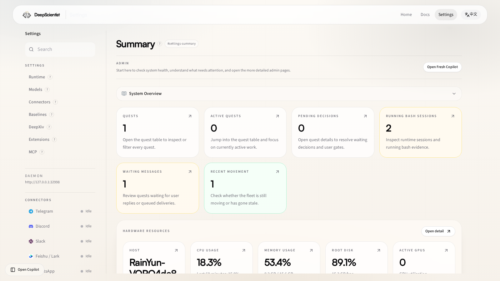

## 2. Sessions & Hardware

Route:

- `/settings/runtime`

Use this page when you want:

- the current machine boundary
- GPU selection and prompt hardware policy
- live runtime session evidence

What to do here:

1. verify CPU, memory, root disk, and GPU state
2. check whether the saved GPU boundary matches what you intended
3. inspect the currently selected runtime session output
4. only save a new hardware policy when you intentionally want to change the machine boundary seen by the runtime

Use this page before:

- reporting “the model ignored my GPU”
- assuming the runtime is using all available devices
- debugging a session that may actually be blocked on the wrong machine boundary

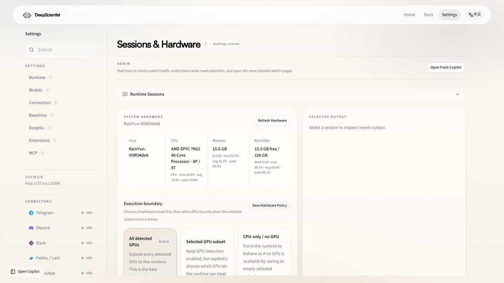

## 3. Connector Health

Route:

- `/settings/connectors-health`

Use this page when you want:

- a fast connector-wide health view
- degraded connector status
- a place to verify whether bindings and discovered targets look normal

What to do here:

1. scan for degraded connectors first
2. confirm whether the affected connector is actually enabled
3. if one connector is clearly wrong, open that connector’s own settings page next
4. if the state is unclear, go to `Errors` before opening logs

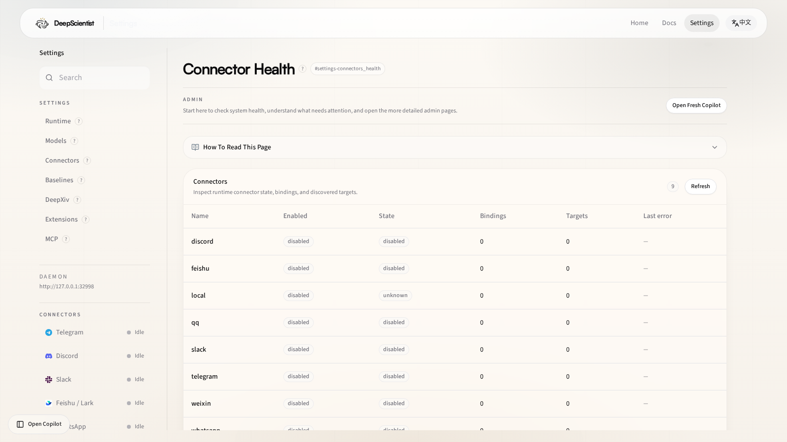

## 4. Diagnostics

Route:

- `/settings/diagnostics`

Use this page when you want:

- explicit doctor runs
- recent failure evidence
- runtime tool readiness and update actions

What to do here:

1. read the cached doctor result before rerunning anything
2. run doctor only when you need a fresh diagnosis
3. check runtime tool readiness on the right side
4. use this page before escalating to shell-level `ds doctor`

This is the best page when the question is:

- “what is wrong with this environment?”
- “is a runtime tool missing?”
- “did the runner probe fail?”

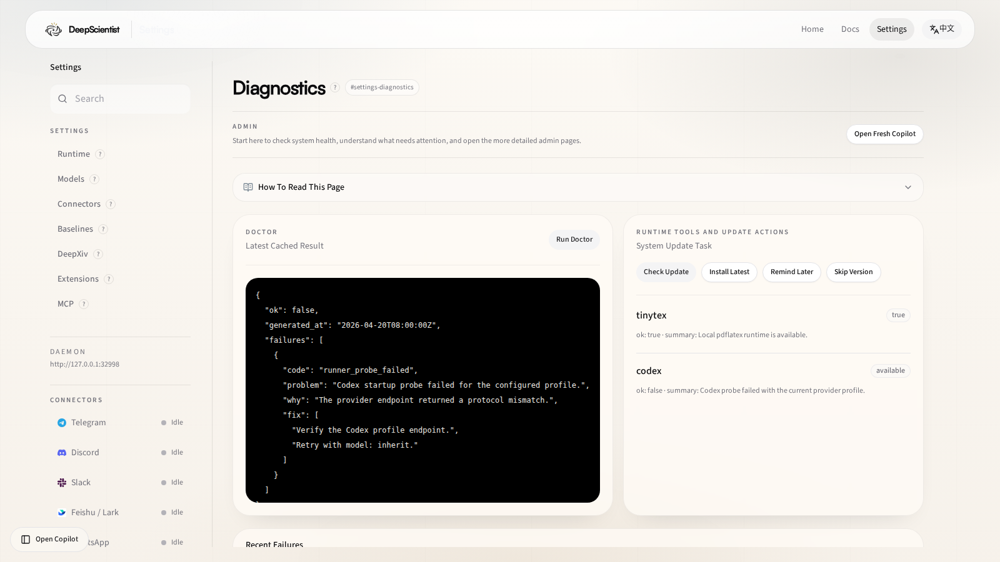

## 5. Errors

Route:

- `/settings/errors`

Use this page when you want:

- one place to review the failures most likely to explain a broken runtime
- a compact operator-first triage surface
- a bridge from failure evidence into the issue reporter

What to do here:

1. read the counters first
2. check degraded connectors and runtime failures before opening logs
3. if the problem is obvious enough, jump directly to `Issue Report`
4. if not, continue to `Logs` or the affected quest

Use this page instead of logs when:

- you want a short explanation first
- you need to decide whether the failure is connector, runtime, daemon, or admin-task related

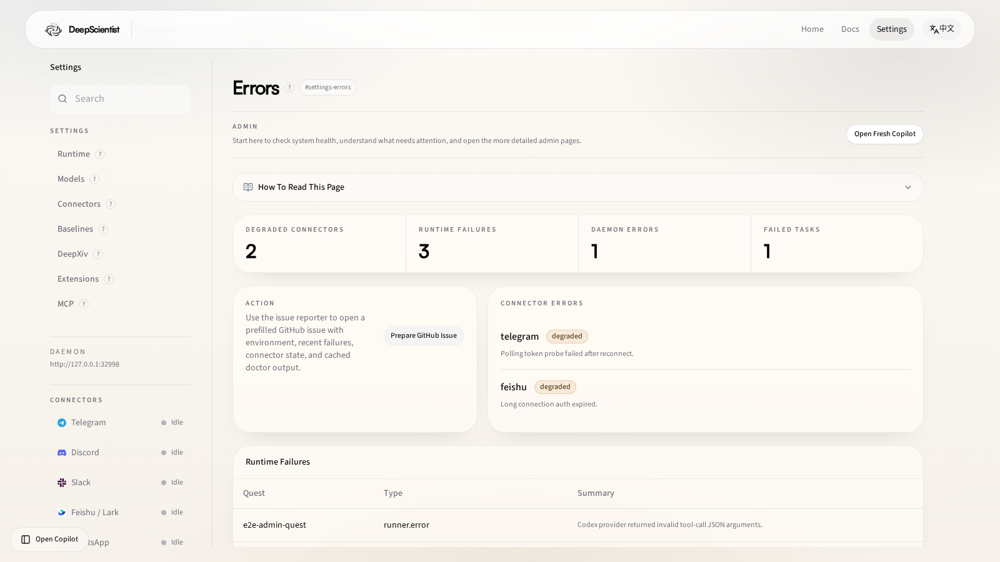

## 6. Issue Report

Route:

- `/settings/issues`

Use this page when you want:

- a prefilled GitHub issue draft
- local operator notes collected before filing
- a cleaner escalation path than copying logs manually

What to do here:

1. come here after `Errors` or `Diagnostics`
2. add a short human summary of what is actually broken
3. keep the issue specific: one problem, one report
4. use this page when you are done gathering evidence, not before

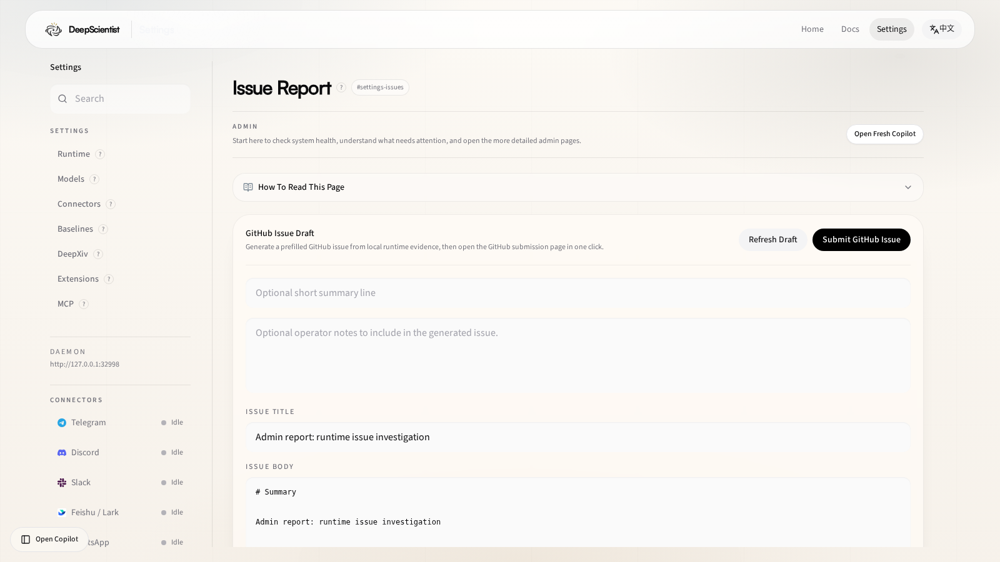

## 7. Logs

Route:

- `/settings/logs`

Use this page when you want:

- raw backend or frontend evidence
- direct visibility into recent daemon logs
- a lower-level page after summary and diagnostics were not enough

What to do here:

1. treat this as an evidence page, not a starting page
2. choose backend or frontend first
3. use filters only after you already know roughly what you are looking for
4. if the logs clearly point to one quest, jump to `Quest Detail`

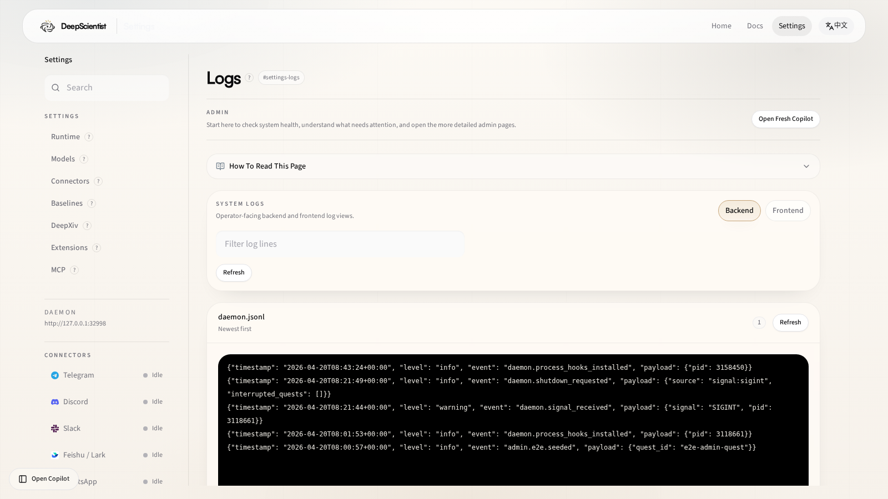

## 8. Quests

Route:

- `/settings/quests`

Use this page when you want:

- a table of all quests
- quick actions such as open, activity, pause, resume, and stop
- list-level inspection before opening a specific quest

What to do here:

1. find the quest row first
2. use `Open` if you need the full detail surface
3. use `Activity` if you only need recent movement
4. do not pause or stop a quest casually unless you already know why

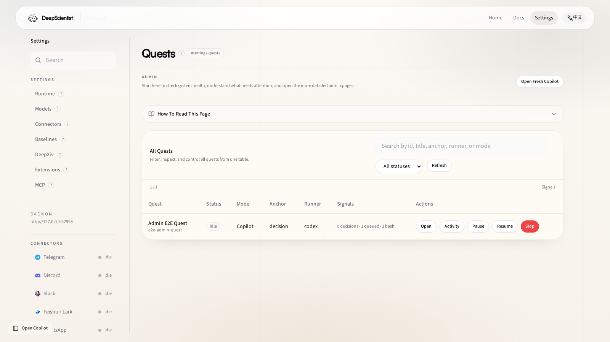

## 9. Quest Detail

Route:

- `/settings/quests/:questId`

Use this page when one quest needs deeper inspection than the table view.

This is the operator version of the quest surfaces. You can use it to inspect:

- activity and recent change movement
- canvas / memory / terminal / settings tabs
- quest-specific controls from inside the admin flow

Recommended reading order inside one quest:

1. `Activity`
2. `Details`
3. `Canvas`
4. `Terminal`
5. `Settings`

That order keeps you on the higher-signal surfaces first.

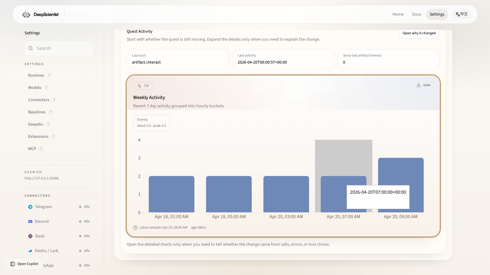

## 10. Repairs

Route:

- `/settings/repairs`

Use this page when you want:

- the current list of repair attempts
- durable repair context instead of one-off debugging
- a reopen point for previous operator sessions

What to do here:

1. use this page when debugging is no longer ad hoc
2. reopen or inspect the repair entry instead of restarting from scratch
3. keep one repair thread focused on one operational problem

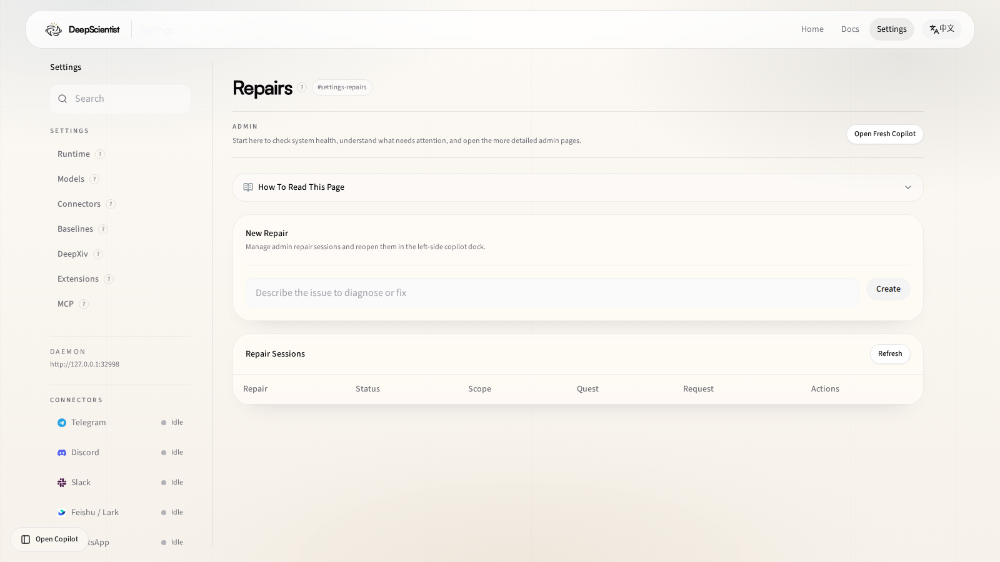

## 11. Controllers

Route:

- `/settings/controllers`

Use this page when you want:

- built-in governance controllers
- enable / disable control policy
- manual controller execution from a visible registry

What to do here:

1. use this page for policy enforcement, not ordinary debugging
2. review which controllers are enabled
3. run a controller intentionally when you want a governance check, not as a random repair attempt

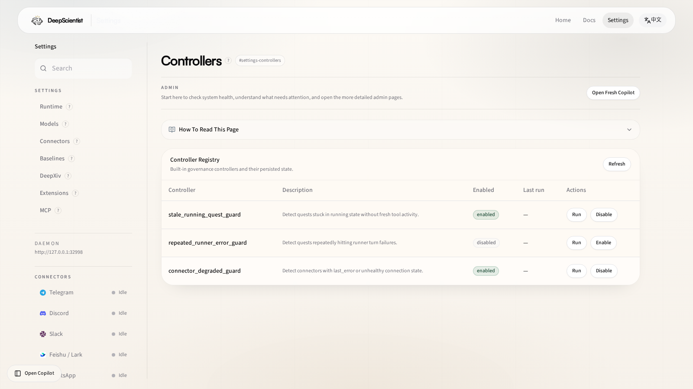

## 12. Stats

Route:

- `/settings/stats`

Use this page when you want:

- the larger chart surface behind the summary page
- time-range aware trend charts
- quest analytics entry points for detailed inspection

What to do here:

1. open detailed charts only when the summary page was not enough
2. change the range before interpreting spikes or drops
3. use quest analytics links when one quest dominates the trend and you want to inspect it directly

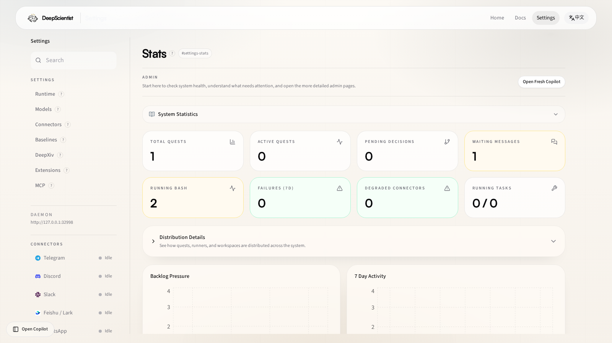

## 13. Search

Route:

- `/settings/search`

Use this page when you want:

- cross-quest lookup by summary terms
- a quick search surface for admin-visible signals
- a faster route than opening quests one by one

What to do here:

1. search by quest id, short failure phrase, or a small incident summary
2. treat results as entry points, not as the final evidence
3. open the matching quest or logs after you identify the right target

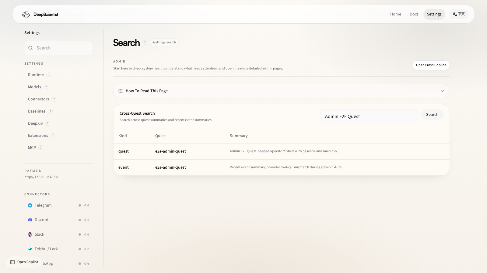

## 14. Recommended Reading Order

For most operator tasks, the fastest route is:

1. `Summary`
2. `Runtime` or `Connector Health`
3. `Diagnostics` or `Errors`
4. `Logs`
5. `Quests` and then `Quest Detail`

That keeps you on the higher-signal pages first instead of jumping into raw logs too early.

## 15. A Safe Default Workflow

If the product “feels wrong” but you do not know why yet, use this exact sequence:

1. open `Summary`
2. open `Runtime` if the problem looks machine- or session-related
3. open `Connector Health` if the problem looks message- or delivery-related
4. open `Diagnostics` if the problem looks environment-related
5. open `Errors` if the problem looks like a real failure rather than just an unclear state
6. open `Logs` only after the earlier pages narrowed the problem
7. open `Quests` and then `Quest Detail` if one quest is clearly responsible

That flow is slower than guessing, but much faster than random page-hopping.

## 16. Related Docs

- [01 Settings Reference](./01_SETTINGS_REFERENCE.md)
- [09 Doctor](./09_DOCTOR.md)
- [03 QQ Connector Guide](./03_QQ_CONNECTOR_GUIDE.md)
- [10 Weixin Connector Guide](./10_WEIXIN_CONNECTOR_GUIDE.md)
